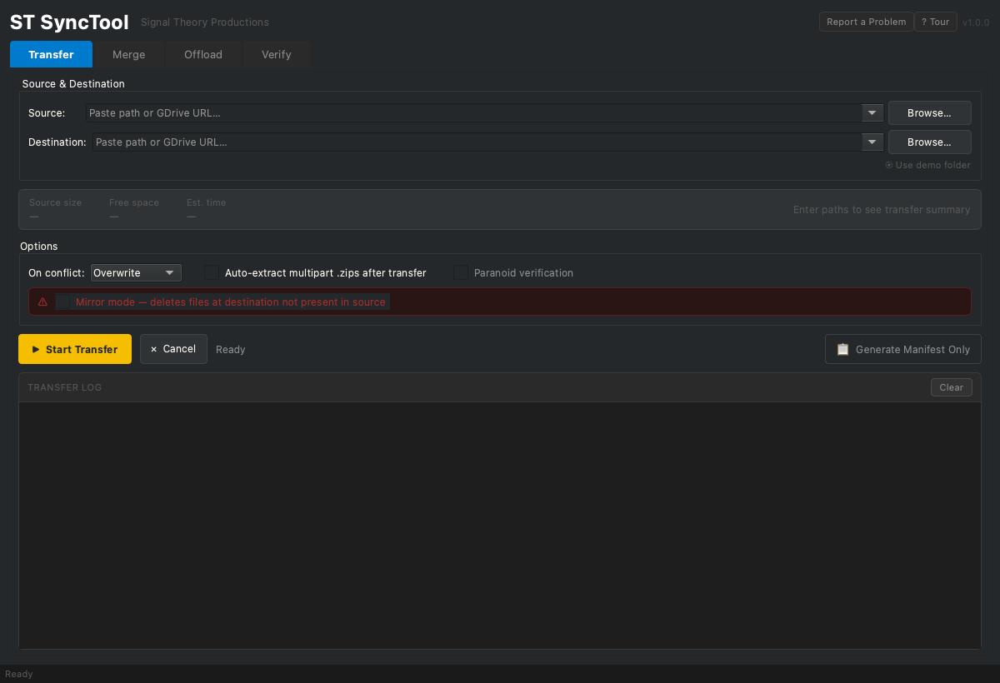
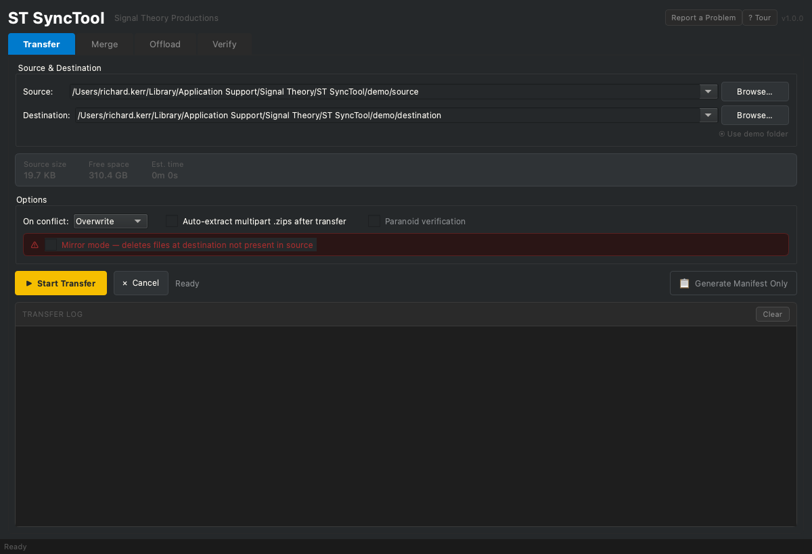
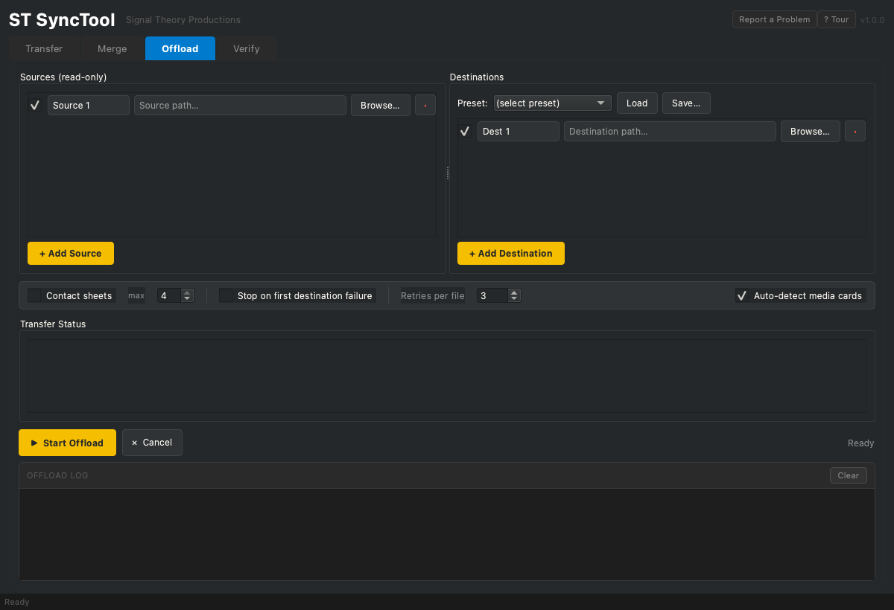
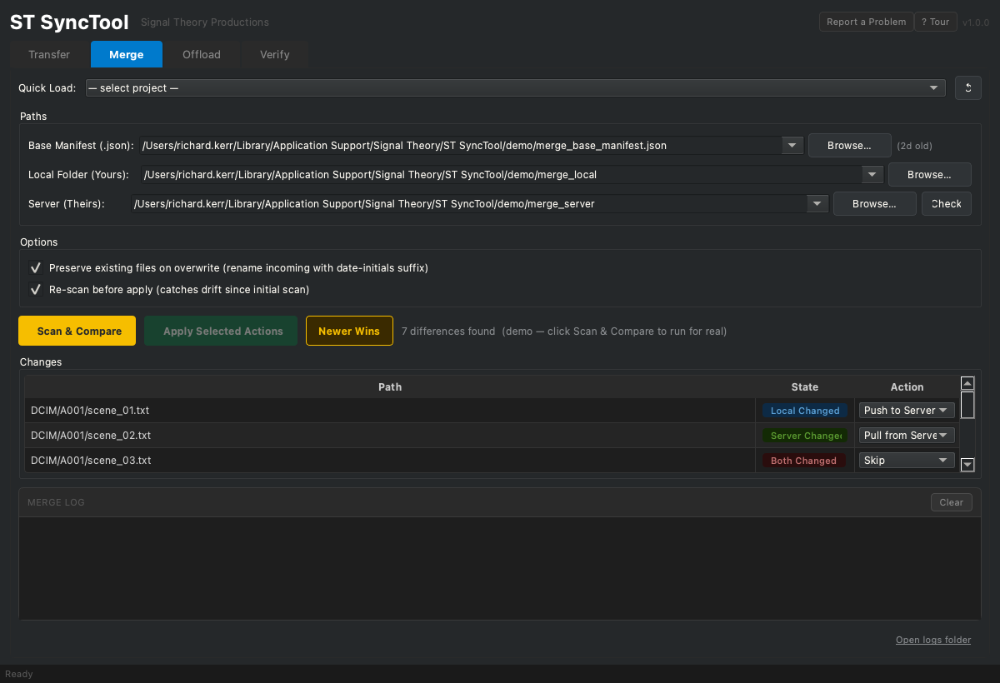
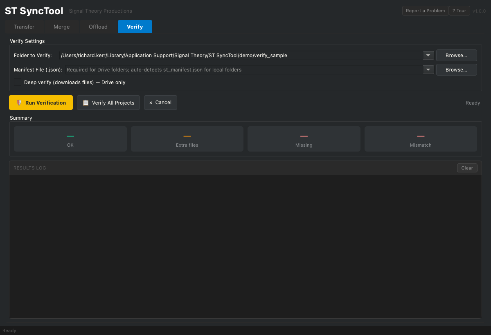

# ST SyncTool Quick Start

A one-page guide to the three core flows: offload a card, merge a project and verify an archive. No terminal or developer knowledge needed.

When you launch the app you see four tabs across the top: **Transfer**, **Merge**, **Offload** and **Verify**. The running version is shown top-right next to the **Report a Problem** and **Tour** buttons.

> **Tip:** every tab has a **Use demo folder** link or a tour that loads safe zero-byte sample files, so you can practice each flow without touching real media. Press **? Tour** any time for a guided walkthrough.

---

## 1. Transfer files

Use the **Transfer** tab for a straightforward copy from one location to another: local to local, local to Drive, Drive to local or Drive to Drive. This is the tab the app opens on.

1. Open the **Transfer** tab.
2. Set **Source** and **Destination** with **Browse...**, or paste a path or a Google Drive URL into either field. **Use demo folder** fills both with safe sample folders to practice on.
3. The pre-flight summary shows source size, free space at the destination and an estimated time before you start.
4. Pick an **On conflict** policy: Overwrite, Skip or a preserve option. Optional: tick **Paranoid verification** to re-hash every file after copying, or **Auto-extract multipart .zips** to unpack archives on arrival.
5. Click **Start Transfer**. The log records every file, and a manifest is written when it finishes. Use **Generate Manifest Only** to fingerprint a folder without copying.

Drive to Drive transfers run server-side, so no local disk space is used.

> **Mirror mode** deletes files at the destination that are not in the source. It is off by default and flagged in red. Use it only when you want the destination to become an exact copy.

---

## 2. Offload a card

Use the **Offload** tab to copy a camera card to one or more destinations with full verification. The source is always treated as read-only, so the card is never modified.

1. Open the **Offload** tab.
2. Under **Sources (read-only)**, click **Browse...** on Source 1 and pick the card or folder. The app auto-detects inserted media cards when **Auto-detect media cards** is ticked. Click **+ Add Source** to offload more than one card at once.
3. Under **Destinations**, click **Browse...** on Dest 1 and pick the first destination (for example a shuttle drive). Click **+ Add Destination** to copy to a second location in the same run. Two clean destinations is what unlocks the "safe to format" clearance.
4. Optional: tick **Contact sheets** for thumbnail sheets, or **Stop on first destination failure** to halt if any destination errors.
5. Click **Start Offload**. Progress shows per destination in the status area, and the log records every file.
6. When it finishes, each source shows a clearance verdict. A green **"All N files verified on K destinations. Card is safe to format"** appears only when at least two destinations verified clean. Otherwise an amber notice explains why it is not cleared.

A chain-of-custody log and a manifest are written to `~/Documents/STSyncTool/` for every offload.

---

## 3. Merge a project

Use the **Merge** tab to reconcile your local copy of a project with the server (NAS or Drive) copy, resolving any conflicts deliberately.

1. Open the **Merge** tab.
2. Set the three paths: **Local Folder (Yours)**, **Server (Theirs)** and the **Base Manifest** that records the shared starting point. Use **Quick Load** to recall a registered project instead of typing paths.
3. Click **Scan & Compare**. The **Changes** table lists every difference with a colour-coded **State**: Local Changed, Server Changed, Both Changed (a conflict), Local Only, Server Only and deletions.
4. The summary line above the table tells you at a glance how many files sync automatically, how many conflicts need review and how many deletions are held for you.
5. For each row pick an **Action** from the dropdown (Push to Server, Pull from Server, Skip and so on). Conflicts (Both Changed) start unresolved and need your choice. **Newer Wins** sets a sensible default across the board.
6. When you are happy with the actions, click **Apply Selected Actions**. With **Preserve existing files on overwrite** ticked, an overwritten file is renamed with a date-initials suffix rather than lost.

---

## 4. Verify an archive

Use the **Verify** tab to confirm an archive still matches its manifest, file by file, by checksum.

1. Open the **Verify** tab.
2. Click **Browse...** on **Folder to Verify** and pick the archive folder. For a local folder the app auto-detects its `st_manifest.json`. For a Drive folder, point **Manifest File** at the matching manifest.
3. Optional: tick **Deep verify (downloads files)** for a Drive folder to stream every file through a real hash check instead of trusting Drive metadata. This uses bandwidth, so an estimate is shown up front.
4. Click **Run Verification**. The summary tiles show OK, Extra files, Missing and Mismatch counts, and the results log lists every file.
5. To check every registered project at once, click **Verify All Projects** for a single consolidated report.

A verify report is saved to `~/Documents/STSyncTool/logs/` after each run.

---

## Reporting a problem

If something goes wrong, click **Report a Problem** in the top-right. It bundles your recent logs plus the app version and OS info into a single zip, then reveals it in Finder. Attach that zip to an email describing what happened. Nothing is uploaded automatically.

---

*Screenshots are generated from the live app with demo data by `docs/capture_screenshots.py`. Re-run it after any UI change to refresh them.*
